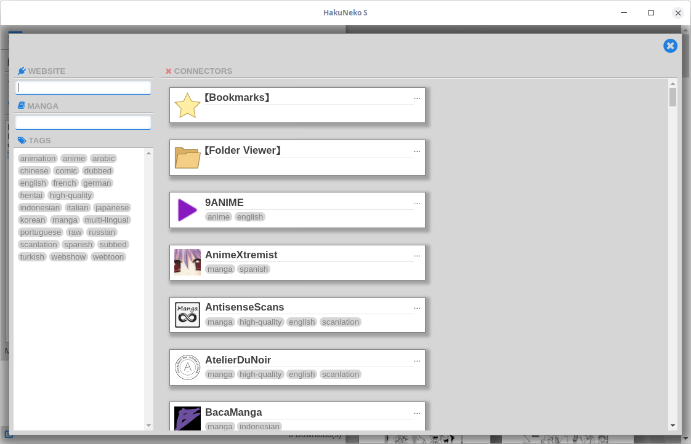

// https://asciidoctor.org/docs/user-manual
// https://asciidoctor.org/docs/asciidoc-syntax-quick-reference/
// https://mister-gold.pro/posts/en/asciidoc-vs-markdown/

= HakuNeko - Manga & Anime Downloader

//:toc:
:numbered:
:icons: font

HakuNeko is a cross-platform downloader for manga and anime from various websites.

== Download

HakuNeko provides different installation files for various operating systems.
There is also a portable version available which stores all its application data in its application folder.
Download and run the installer/archive for your operating system from one of the mirror sites below.

===== Mirrors

image::https://img.shields.io/github/downloads/manga-download/hakuneko/latest/total.svg?label=HakuNeko%200.4.0&logo=github[link=https://github.com/manga-download/hakuneko/releases/tag/0.4.0]

image::https://img.shields.io/sourceforge/dt/hakuneko/0.4.0.svg?label=HakuNeko%200.4.0&logo=sourceforge[link=https://sourceforge.net/projects/hakuneko/files/0.4.0/]

== Screenshots

image::doc/screenshot-loading.png[height=120, link=doc/screenshot-websites.png, title="Loading Screen"]

image::doc/screenshot-settings.png[height=120, link=doc/screenshot-settings.png, title="Application Settings"]

image::doc/screenshot-video.png[height=120, link=doc/screenshot-video.png, title="Anime Playback"]

image::doc/screenshot-pages.png[height=120, link=doc/screenshot-pages.png, title="Chapter Pages"]

== Development

...

=== Setup the Environment

This section describes the process of installing all tools, frameworks and libraries required for HakuNeko's development.
All steps are briefly explained, without going into details (e.g. operating system specific variations).
For further information please visit the corresponding website.

git::

The version control system required for HakuNeko is https://git-scm.com[_git_].
It is used to checkout the latest sourcecode of HakuNeko from https://github.com/manga-download/hakuneko[_GitHub_], or commit changes to the repository.
https://git-scm.com/downloads[Download] and install _git_ for your operating system.

NodeJS & NPM::

https://nodejs.org[_NodeJS_] is a _JavaScript_ runtime that allows to execute applications written in _JavaScript_.
https://www.npmjs.com/get-npm[_NPM_] is a package manager for _NodeJS_ that simplifies the process of downloading and installing _JavaScript_ applications and libraries, which are published in a central repository.
https://nodejs.org/en/download/[Download] and install _NodeJS_ and _NPM_ for your operating system.

electron::

_electron_ is a framework which provides the ability to build desktop applications using web-technologies (such as _HTML_, _CSS_, _JavaScript_).
Basically this is a modified chrome browser coupled with a _NodeJS_ backend to provide access to system functions.
Open a terminal as administrator and type the command `npm --version`, which will show the version number of _NPM_.
If this fails make sure _NodeJS_ and _NPM_ are installed properly.
Now type `npm install electron -g --unsafe-perm=true` to install _electron_ system-wide.

Polymer-CLI (optional)::

A collection of commandline tools to create web-applications based on https://www.polymer-project.org[_Polymer_].
This package is optional and only required for publishing (build & deploy) the web-application.
For development and local execution it is fine to skip the installation.
Open a terminal as administrator and type the command `npm --version`, which will show the version number of _NPM_.
If this fails make sure _NodeJS_ and _NPM_ are installed properly.
Now type `npm install polymer-cli -g` to install the polymer-cli system-wide.

Editor or IDE (optional)::

It is possible to only use a simple text editor, but it is more easier with a powerful source code editor or even an IDE.
Use what you like, here are some examples:
* https://code.visualstudio.com/download[Visual Studio Code]
* https://flight-manual.atom.io/getting-started/sections/installing-atom[Atom]
* http://brackets.io[Brackets]
* https://www.jetbrains.com/webstorm[WebStorm]

=== Getting the Source Code

The source code for HakuNeko can be found in a https://github.com/manga-download/hakuneko[public repository] on _GitHub_.
There is also a https://sourceforge.net/p/hakuneko/code/[mirror] on _SourceForge_, but developers are encouraged to use the one from _GitHub_ as the upstream repository.

==== Fork

If you plan to make contributions without becoming a project member, it might be useful to create a fork of the project, before getting the source code.
Many developers may disagree, but personally i dislike the overhead of the https://gist.github.com/Chaser324/ce0505fbed06b947d962[Fork & Pull Request Workflow] for open source projects.
If you are wiling to contribute to a project, then you deserve it to become a member.

==== Clone the Repository

Open a terminal and run the following commands:

[source,bash]
----
cd ~/Projects // <1>
git --version // <2>
git clone 'https://github.com/manga-download/hakuneko.git' hakuneko // <3>
----

<1> Change into the directory where you wanna checkout the source code
<2> Show the version number of _git_, if this fails make sure _git_ is installed properly
<3> Clone either the upstream repository or your fork into the hakuneko sub-directory

==== Project Structure

There are two folders inside HakuNeko's source directory.
Each folder can be ...

The reason both projects are in the same repository is the fact that they are tightly coupled together in the debugging and deployment process.

===== Folder: electron

...

===== Folder: web

...

=== Run

To start the local development version, open a terminal and run the following commands:

[source,bash]
----
cd ~/Projects/hakuneko/electron // <1>
electron src // <2>
----

<1> Change into the electron folder
<2> Start the system-wide installed electron framework with the HakuNeko desktop app

=== Debug

...

=== Build and Deploy

...